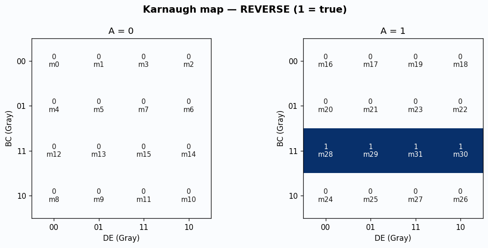
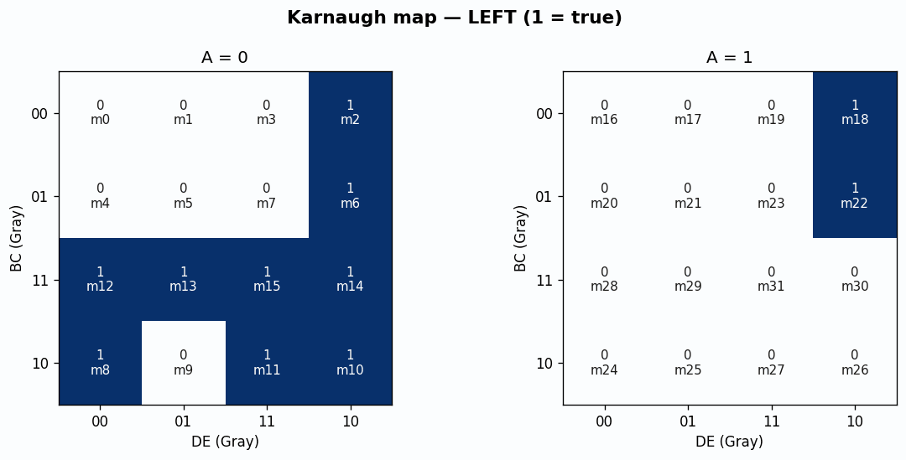
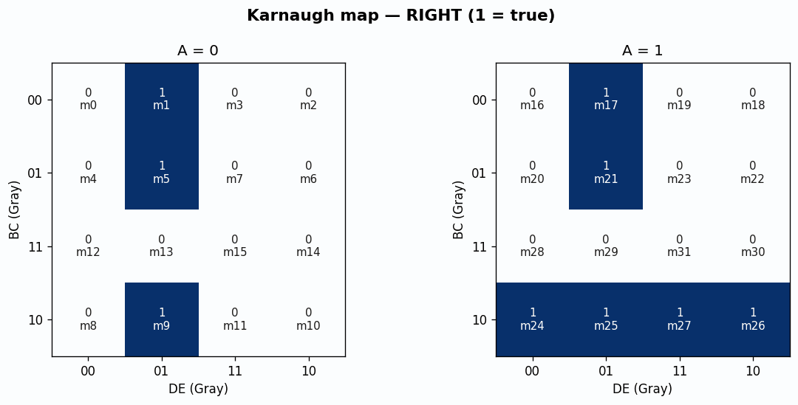
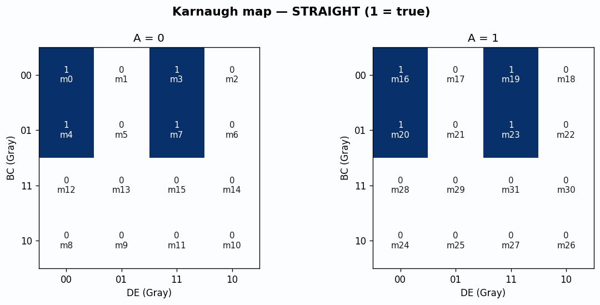

# Line Following Robot — Submission 2

**Course:** Digital Logic Design  
**Project:** LFR Maze Challenge — Phase 1 (combinational logic)

**Group**

| Name | Registration |
|---|---|
| Raman Kumar | 32373 |
| Kartar Kumar | 32379 |
| Bilal Ahmed | 32351 |
| Ramsha Qasim | 32362 |

## 1. Problem and design objective

The robot must follow a black line on a white maze floor without touching the walls. Five sensors feed a **combinational** circuit (no Arduino). The circuit drives an L298N dual H-bridge.

A, B, and C detect **walls**. D and E look **down** at the line and straddle it. Straight motion means the tape sits in the gap between D and E (`D=0`, `E=0`).

When **left, front, and right walls are all present** (`A=B=C=1`), that cell is a **dead end**. The robot **reverses** (both wheels backward). As soon as the front wall sensor goes to 0, the same table resumes: it will pivot left or right into the open side. That is still combinational: reverse *while* boxed in, turn *when* a side opens.

## 2. Sensor encoding

| Signal | Placement | 1 | 0 |
|---|---|---|---|
| A | Left wall | Wall close | Open |
| B | Front wall | Wall ahead | Front clear |
| C | Right wall | Wall close | Open |
| D | Left downward | On black line | White floor |
| E | Right downward | On black line | White floor |

Hardware: 5 × TCRT5000 digital modules. If a module is active-low, invert it with the spare 74HC04 gate so the table below stays true.

## 3. Motor outputs (L298N)

| Signal | L298N pin | Wheel | 1 means |
|---|---|---|---|
| LF | IN1 | Left | Left wheel forward |
| LB | IN2 | Left | Left wheel backward |
| RF | IN3 | Right | Right wheel forward |
| RB | IN4 | Right | Right wheel backward |

| Action | LF | LB | RF | RB | Motion |
|---|---|---|---|---|---|
| Straight | 1 | 0 | 1 | 0 | Both wheels forward |
| Pivot left | 0 | 1 | 1 | 0 | Left back, right forward |
| Pivot right | 1 | 0 | 0 | 1 | Left forward, right back |
| Reverse | 0 | 1 | 0 | 1 | Both wheels backward (dead end) |

LF and LB are never 1 together. RF and RB are never 1 together.

## 4. Decision rules (first match wins)

1. If `A·B·C = 1` → **REVERSE** (dead end).
2. If `B=1`, `A=0`, `C=1` → **LEFT** (only left is open).
3. If `B=1`, `A=1`, `C=0` → **RIGHT** (only right is open).
4. If `B=1`, `A=0`, `C=0`, `D=0`, `E=1` → **RIGHT** (wall ahead, both sides look open, line under E).
5. If `B=1`, `A=0`, `C=0` → **LEFT** (wall ahead, both sides look open, otherwise).
6. If `B=0`, `D=1`, `E=0` → **LEFT** (line slipped under D).
7. If `B=0`, `D=0`, `E=1` → **RIGHT** (line slipped under E).
8. If `B=0` and `D=E` → **STRAIGHT** (line in the gap, or wide centered line).

## 5. Complete truth table (32 rows)

| # | A | B | C | D | E | Action | LF | LB | RF | RB | What it is |
|---|---|---|---|---|---|---|---|---|---|---|---|
| 0 | 0 | 0 | 0 | 0 | 0 | STRAIGHT | 1 | 0 | 1 | 0 | No walls. Line in the gap. |
| 1 | 0 | 0 | 0 | 0 | 1 | RIGHT | 1 | 0 | 0 | 1 | Front open. Line under E → correct right. |
| 2 | 0 | 0 | 0 | 1 | 0 | LEFT | 0 | 1 | 1 | 0 | Front open. Line under D → correct left. |
| 3 | 0 | 0 | 0 | 1 | 1 | STRAIGHT | 1 | 0 | 1 | 0 | Front open. Wide centered line. |
| 4 | 0 | 0 | 1 | 0 | 0 | STRAIGHT | 1 | 0 | 1 | 0 | Right wall only. Line in the gap. |
| 5 | 0 | 0 | 1 | 0 | 1 | RIGHT | 1 | 0 | 0 | 1 | Front open. Line under E. |
| 6 | 0 | 0 | 1 | 1 | 0 | LEFT | 0 | 1 | 1 | 0 | Front open. Line under D. |
| 7 | 0 | 0 | 1 | 1 | 1 | STRAIGHT | 1 | 0 | 1 | 0 | Right wall. Wide centered line. |
| 8 | 0 | 1 | 0 | 0 | 0 | LEFT | 0 | 1 | 1 | 0 | Wall ahead, both sides open, line still in the gap → left. |
| 9 | 0 | 1 | 0 | 0 | 1 | RIGHT | 1 | 0 | 0 | 1 | Wall ahead, both sides open, line under E → right. |
| 10 | 0 | 1 | 0 | 1 | 0 | LEFT | 0 | 1 | 1 | 0 | Wall ahead, both sides open, line under D → left. |
| 11 | 0 | 1 | 0 | 1 | 1 | LEFT | 0 | 1 | 1 | 0 | Wall ahead, both sides open, wide line → left. |
| 12 | 0 | 1 | 1 | 0 | 0 | LEFT | 0 | 1 | 1 | 0 | Wall ahead, right blocked, left open. |
| 13 | 0 | 1 | 1 | 0 | 1 | LEFT | 0 | 1 | 1 | 0 | Dead-end-like on the right. Turn left. |
| 14 | 0 | 1 | 1 | 1 | 0 | LEFT | 0 | 1 | 1 | 0 | Wall ahead, only left open. |
| 15 | 0 | 1 | 1 | 1 | 1 | LEFT | 0 | 1 | 1 | 0 | Wall ahead, only left open. |
| 16 | 1 | 0 | 0 | 0 | 0 | STRAIGHT | 1 | 0 | 1 | 0 | Left wall only. Line in the gap. |
| 17 | 1 | 0 | 0 | 0 | 1 | RIGHT | 1 | 0 | 0 | 1 | Front open. Line under E. |
| 18 | 1 | 0 | 0 | 1 | 0 | LEFT | 0 | 1 | 1 | 0 | Front open. Line under D. |
| 19 | 1 | 0 | 0 | 1 | 1 | STRAIGHT | 1 | 0 | 1 | 0 | Left wall. Wide centered line. |
| 20 | 1 | 0 | 1 | 0 | 0 | STRAIGHT | 1 | 0 | 1 | 0 | Corridor. Walls both sides, front open, line in the gap. |
| 21 | 1 | 0 | 1 | 0 | 1 | RIGHT | 1 | 0 | 0 | 1 | Corridor. Line slipped under E → correct right. |
| 22 | 1 | 0 | 1 | 1 | 0 | LEFT | 0 | 1 | 1 | 0 | Corridor. Line slipped under D → correct left. |
| 23 | 1 | 0 | 1 | 1 | 1 | STRAIGHT | 1 | 0 | 1 | 0 | Corridor. Wide line, still centered. |
| 24 | 1 | 1 | 0 | 0 | 0 | RIGHT | 1 | 0 | 0 | 1 | Wall ahead, left blocked, right open. |
| 25 | 1 | 1 | 0 | 0 | 1 | RIGHT | 1 | 0 | 0 | 1 | Wall ahead, only right open. |
| 26 | 1 | 1 | 0 | 1 | 0 | RIGHT | 1 | 0 | 0 | 1 | Wall ahead, only right open. |
| 27 | 1 | 1 | 0 | 1 | 1 | RIGHT | 1 | 0 | 0 | 1 | Wall ahead, only right open. |
| 28 | 1 | 1 | 1 | 0 | 0 | REVERSE | 0 | 1 | 0 | 1 | DEAD END. Reverse. |
| 29 | 1 | 1 | 1 | 0 | 1 | REVERSE | 0 | 1 | 0 | 1 | DEAD END. Reverse. |
| 30 | 1 | 1 | 1 | 1 | 0 | REVERSE | 0 | 1 | 0 | 1 | DEAD END. Reverse. |
| 31 | 1 | 1 | 1 | 1 | 1 | REVERSE | 0 | 1 | 0 | 1 | DEAD END. Reverse. |

Counts: Straight 8 · Left 11 · Right 9 · Reverse 4.

## 6. Karnaugh maps

Five variables are mapped as **two 4-variable K-maps** split on **A**. Rows are **BC**, columns are **DE**, both in **Gray code** `00 01 11 10` so adjacent cells differ by one bit. Cell text is `mN=value`.

PNG figures are in `kmaps/`. Groups used for the SOP are listed first.

### REVERSE

- **A · B · C** covers minterms [28, 29, 30, 31]. Dead end: walls on left, front, and right. Independent of D and E.



### K-map for REVERSE — A = 0

| BC \\ DE | 00 | 01 | 11 | 10 |
|---|---|---|---|---|
| 00 | m0=0 | m1=0 | m3=0 | m2=0 |
| 01 | m4=0 | m5=0 | m7=0 | m6=0 |
| 11 | m12=0 | m13=0 | m15=0 | m14=0 |
| 10 | m8=0 | m9=0 | m11=0 | m10=0 |

### K-map for REVERSE — A = 1

| BC \\ DE | 00 | 01 | 11 | 10 |
|---|---|---|---|---|
| 00 | m16=0 | m17=0 | m19=0 | m18=0 |
| 01 | m20=0 | m21=0 | m23=0 | m22=0 |
| 11 | m28=1 | m29=1 | m31=1 | m30=1 |
| 10 | m24=0 | m25=0 | m27=0 | m26=0 |

### LEFT

- **Ā · B · C** covers minterms [12, 13, 14, 15]. Wall ahead, right blocked, left open.
- **Ā · B · D** covers minterms [10, 11, 14, 15]. Wall ahead (A=0); line under D or wide line.
- **Ā · B · Ē** covers minterms [8, 10, 12, 14]. Wall ahead, both sides open, line not on E → left.
- **D · B̄ · Ē** covers minterms [2, 6, 18, 22]. Front open; line slipped under D.



### K-map for LEFT — A = 0

| BC \\ DE | 00 | 01 | 11 | 10 |
|---|---|---|---|---|
| 00 | m0=0 | m1=0 | m3=0 | m2=1 |
| 01 | m4=0 | m5=0 | m7=0 | m6=1 |
| 11 | m12=1 | m13=1 | m15=1 | m14=1 |
| 10 | m8=1 | m9=0 | m11=1 | m10=1 |

### K-map for LEFT — A = 1

| BC \\ DE | 00 | 01 | 11 | 10 |
|---|---|---|---|---|
| 00 | m16=0 | m17=0 | m19=0 | m18=1 |
| 01 | m20=0 | m21=0 | m23=0 | m22=1 |
| 11 | m28=0 | m29=0 | m31=0 | m30=0 |
| 10 | m24=0 | m25=0 | m27=0 | m26=0 |

### RIGHT

- **A · B · Č** covers minterms [24, 25, 26, 27]. Wall ahead, left blocked, right open.
- **B̄ · D̄ · E** covers minterms [1, 5, 17, 21]. Front open; line slipped under E.
- **Č · D̄ · E** covers minterms [1, 5, 9, 17, 21]. Line under E (includes wall-ahead tie row 9).



### K-map for RIGHT — A = 0

| BC \\ DE | 00 | 01 | 11 | 10 |
|---|---|---|---|---|
| 00 | m0=0 | m1=1 | m3=0 | m2=0 |
| 01 | m4=0 | m5=1 | m7=0 | m6=0 |
| 11 | m12=0 | m13=0 | m15=0 | m14=0 |
| 10 | m8=0 | m9=1 | m11=0 | m10=0 |

### K-map for RIGHT — A = 1

| BC \\ DE | 00 | 01 | 11 | 10 |
|---|---|---|---|---|
| 00 | m16=0 | m17=1 | m19=0 | m18=0 |
| 01 | m20=0 | m21=1 | m23=0 | m22=0 |
| 11 | m28=0 | m29=0 | m31=0 | m30=0 |
| 10 | m24=1 | m25=1 | m27=1 | m26=1 |

### STRAIGHT

- **B̄ · (D ⊕ E)̄** covers minterms [0, 3, 4, 7, 16, 19, 20, 23]. Front clear and D equals E (gap or wide centered line).
- **B̄ · D̄ · Ē** covers minterms [0, 4, 16, 20]. Line in the D–E gap. Row 20 is the corridor 10100.
- **B̄ · D · E** covers minterms [3, 7, 19, 23]. Wide line still centered.



### K-map for STRAIGHT — A = 0

| BC \\ DE | 00 | 01 | 11 | 10 |
|---|---|---|---|---|
| 00 | m0=1 | m1=0 | m3=1 | m2=0 |
| 01 | m4=1 | m5=0 | m7=1 | m6=0 |
| 11 | m12=0 | m13=0 | m15=0 | m14=0 |
| 10 | m8=0 | m9=0 | m11=0 | m10=0 |

### K-map for STRAIGHT — A = 1

| BC \\ DE | 00 | 01 | 11 | 10 |
|---|---|---|---|---|
| 00 | m16=1 | m17=0 | m19=1 | m18=0 |
| 01 | m20=1 | m21=0 | m23=1 | m22=0 |
| 11 | m28=0 | m29=0 | m31=0 | m30=0 |
| 10 | m24=0 | m25=0 | m27=0 | m26=0 |

Motor-pin K-maps (what is actually wired) are in `kmaps/kmap_motor_lf.png` through `kmap_motor_rb.png`.

## 7. Minimized Boolean equations

A prime (`'`) means NOT.

```
LEFT     = A' B C + A' B D + A' B E' + D B' E'
RIGHT    = A B C' + B' D' E + C' D' E
STRAIGHT = B' D E + B' D' E'  =  B' (D E + D' E')
REVERSE  = A B C

LF = STRAIGHT + RIGHT
LB = LEFT + REVERSE   = B C + A' B D + A' B E' + B' D E'
RF = STRAIGHT + LEFT
RB = RIGHT + REVERSE  = A B + B' D' E + C' D' E
```

`LB` simplified because `A'BC + ABC = BC`. `RB` simplified because `ABC' + ABC = AB`.

## 8. Circuit implementation

See `circuit_diagram.svg`.

Shared terms:

- `P1 = D E'`
- `P2 = D' E`
- `REV = A B C`
- `WL = A' B (C + D + E')`
- `WR = B C' (A + P2)`

Then:

- `LEFT = WL + B' P1`
- `RIGHT = WR + B' P2`
- `STRAIGHT = B' (D E + D' E')`
- `LF = STRAIGHT + RIGHT` → L298N IN1
- `LB = LEFT + REV` → IN2
- `RF = STRAIGHT + LEFT` → IN3
- `RB = RIGHT + REV` → IN4

**ICs:** 74HC04 × 1 (five inverters), 74HC08 × 3 (AND), 74HC32 × 3 (OR).

ENA and ENB jumpers left on. 7.4 V pack on the motor supply only. 5 V for gates and sensors. One common ground. Do not parallel a power-bank 5 V with the L298N regulator.

## 9. Selected components (from Submission 1)

- Sensors: TCRT5000 × 5 (digital).
- Motor driver: L298N.
- Motors: 2 × TT geared DC motors.
- Chassis: about 11 cm × 12 cm (an 8-inch corridor is 20.3 cm; a 15×12 cm plate is too wide to reverse safely).
- Power: 7.4 V 2S Li-ion for motors; 5 V for logic.

## 10. Assumptions and limits

- One black line; no fork memory.
- Combinational reverse does not *choose* the next turn by itself. After reverse, `B` falls to 0 and rules 2–8 pick the turn from the remaining sensors.
- All-white D and E with the front clear is treated as centered, not as line-lost.
- Wall sensors must be calibrated so 1 means a wall about 1 cm away. Black maze walls reflect poorly; test on the real wall.
- Checkered start/finish squares are not logic symbols. Place the robot on the line just after the start checker.

## 11. Files in this zip

| File | Contents |
|---|---|
| `LFR_Submission_2.pdf` | Printable report (cover + full table) |
| `LFR_Submission_2.md` | Same report in Markdown |
| `truth_table.csv` | Spreadsheet |
| `boolean_equations.txt` | Equations only |
| `circuit_diagram.svg` | Gate / L298N diagram |
| `kmaps/*.png` | Karnaugh maps |
